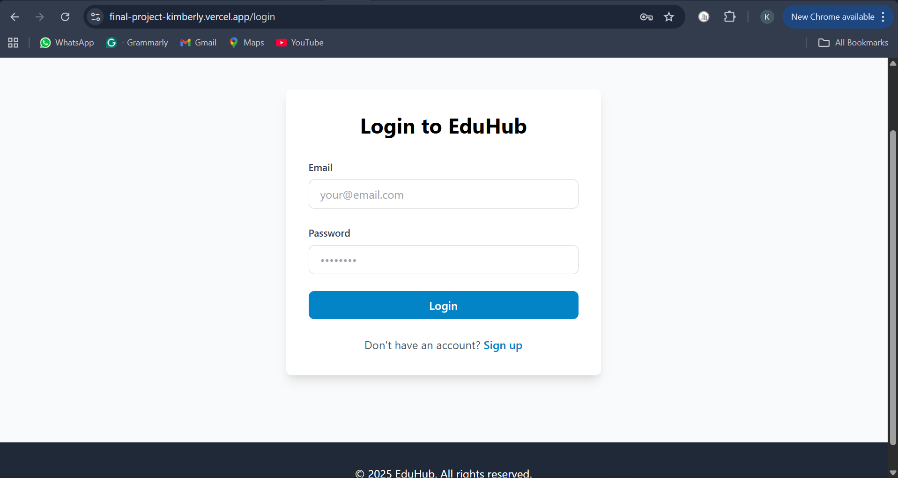
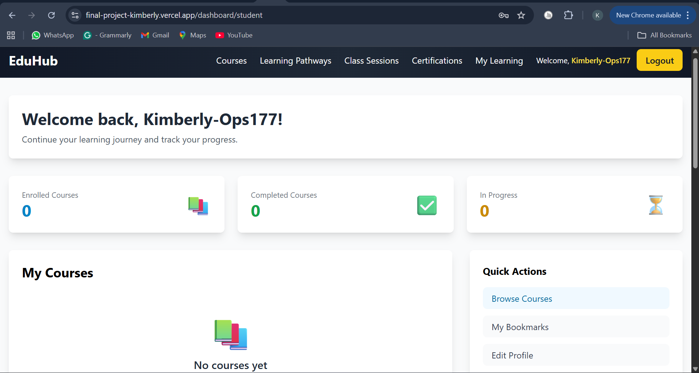

# EduHub - Learning Management System

A fully functional MERN stack learning platform deployed on Vercel and Render. Instructors can create courses and students can enroll, learn, track progress, and interact in real-time. **✅ Production-ready with working authentication and deployment.**

## Project Overview

EduHub is a full-featured Learning Management System (LMS) built with the MERN stack that enables:
- **Instructors** to create and manage courses, modules, lessons, and quizzes
- **Students** to browse courses, enroll, learn, and track their progress
- **Real-time interaction** through live Q&A, notifications, and messaging
- **Social features** including course reviews, ratings, and discussion forums

## Features

### User Management
- JWT-based authentication and authorization
- Two user roles: Student and Instructor
- User profiles with avatar upload
- Role-based dashboards

### Course Management (Instructor)
- Create, edit, and delete courses
- Organize content with modules and lessons
- Create quizzes and assessments
- Track enrolled students and their progress

### Learning Features (Student)
- Browse course catalog with search and filters
- Enroll in courses
- Access course content (lessons, videos)
- Take quizzes and track progress
- Bookmark favorite courses

### Real-time Features
- Live Q&A sessions
- Instant notifications
- Real-time student count
- Live messaging

### Social Features
- Course reviews and ratings
- Discussion forums per course
- Comments on lessons

## Technology Stack

### Backend
- Node.js & Express.js
- MongoDB with Mongoose
- JWT for authentication
- Socket.io for real-time features
- Multer & Cloudinary for file uploads
- bcrypt for password hashing

### Frontend
- React.js with Vite
- React Router for navigation
- Context API for state management
- Axios for API calls
- Socket.io-client for real-time updates
- TailwindCSS for styling
- React Hook Form for form handling

### Testing & Deployment
- Jest & Supertest for backend testing
- React Testing Library for frontend testing
- Cypress for E2E testing
- Backend: Render
- Frontend: Vercel
- Database: MongoDB Atlas

## Project Structure

```
mern-final-project-Kimberly-ops177/
├── backend/
│   ├── src/
│   │   ├── config/         # Database and app configuration
│   │   ├── controllers/    # Request handlers
│   │   ├── middleware/     # Custom middleware
│   │   ├── models/         # Mongoose schemas
│   │   ├── routes/         # API routes
│   │   ├── utils/          # Helper functions
│   │   ├── tests/          # Test files
│   │   └── server.js       # Entry point
│   ├── package.json
│   └── .env.example
├── frontend/
│   ├── src/
│   │   ├── components/     # Reusable components
│   │   ├── pages/          # Page components
│   │   ├── context/        # Context providers
│   │   ├── services/       # API services
│   │   ├── hooks/          # Custom hooks
│   │   ├── utils/          # Helper functions
│   │   └── assets/         # Static assets
│   ├── package.json
│   └── .env.example
├── PROJECT_PLAN.md         # Detailed project plan
├── SETUP.md               # Setup instructions
└── README.md              # This file
```

## 🚀 Quick Start

**Try the Live Application:**
1. Visit: https://final-project-kimberly.vercel.app/
2. Register a new account or login
3. Browse courses and explore features

### Screenshots

#### Homepage


#### Authentication



#### Course Catalog


#### Learning Features




**For Local Development:**

### Prerequisites
- Node.js (v18 or higher)
- MongoDB (local installation or MongoDB Atlas account)
- npm or yarn
- Git

### Installation

1. **Clone the repository**
   ```bash
   git clone <repository-url>
   cd mern-final-project-Kimberly-ops177
   ```

2. **Backend Setup**
   ```bash
   cd backend
   npm install
   cp .env.example .env
   # Edit .env with your configuration
   ```

3. **Frontend Setup**
   ```bash
   cd frontend
   npm install
   cp .env.example .env
   ```

4. **Start Development Servers**

   Terminal 1 (Backend):
   ```bash
   cd backend
   npm run dev
   ```

   Terminal 2 (Frontend):
   ```bash
   cd frontend
   npm run dev
   ```

5. **Access the Application**
   - Frontend: http://localhost:5173
   - Backend API: http://localhost:5000

For detailed setup instructions, see [SETUP.md](SETUP.md).

## Development Status

### ✅ Completed
- [x] Project planning and architecture design
- [x] Database schema design with MongoDB Atlas
- [x] Full API endpoints development (auth, courses, modules, lessons)
- [x] Complete user authentication system (JWT-based)
- [x] Database models implementation (User, Course, Module, Lesson, etc.)
- [x] Frontend authentication flow with React Context
- [x] Course management features for instructors
- [x] Student course enrollment and progress tracking
- [x] Backend server configuration with Express.js
- [x] Environment configuration for development and production
- [x] **Full deployment on Vercel (frontend) and Render (backend)**
- [x] **Production-ready authentication working**

### 🔄 In Progress
- [ ] Real-time features with Socket.io (partially implemented)
- [ ] Advanced testing suite completion
- [ ] Video content integration
- [ ] Payment integration for premium courses

### 📋 Upcoming
- [ ] Mobile app development
- [ ] Advanced analytics dashboard
- [ ] Third-party integrations (Zoom, Google Classroom)
- [ ] Advanced gamification features

## API Documentation

The backend API is fully implemented and documented. Base URL: `https://mern-final-project-kimberly-ops177-1.onrender.com/api`

### Authentication Endpoints
- `POST /api/auth/register` - User registration
- `POST /api/auth/login` - User login
- `GET /api/auth/me` - Get current user profile (protected)
- `PUT /api/auth/profile` - Update user profile (protected)
- `PUT /api/auth/change-password` - Change password (protected)

### Course Endpoints
- `GET /api/courses` - Get all courses (with pagination, search, filters)
- `POST /api/courses` - Create new course (instructor only)
- `GET /api/courses/:id` - Get course details
- `PUT /api/courses/:id` - Update course (instructor only)
- `DELETE /api/courses/:id` - Delete course (instructor only)
- `POST /api/courses/:id/enroll` - Enroll in course (student)

### Module Endpoints
- `GET /api/modules/course/:courseId` - Get modules for a course
- `POST /api/modules` - Create module (instructor)
- `PUT /api/modules/:id` - Update module (instructor)
- `DELETE /api/modules/:id` - Delete module (instructor)

### Lesson Endpoints
- `GET /api/lessons/module/:moduleId` - Get lessons for a module
- `POST /api/lessons` - Create lesson (instructor)
- `PUT /api/lessons/:id` - Update lesson (instructor)
- `DELETE /api/lessons/:id` - Delete lesson (instructor)

### Pathway Endpoints
- `GET /api/pathways` - Get all learning pathways
- `POST /api/pathways` - Create pathway (admin/instructor)
- `GET /api/pathways/:id` - Get pathway details

### Authentication
All protected endpoints require a Bearer token in the Authorization header:
```
Authorization: Bearer <your-jwt-token>
```

For detailed API specifications, see the backend route files and controller implementations.

## Testing

```bash
# Backend tests
cd backend
npm test

# Frontend tests
cd frontend
npm test

# E2E tests
npm run test:e2e
```

## Deployment

The application is fully deployed and production-ready:

- **Live Application**: https://final-project-kimberly.vercel.app/
- **Backend API**: https://mern-final-project-kimberly-ops177-1.onrender.com/
- **Video Demo**: https://docs.google.com/document/d/18K8OQLeOS2vHBordi-JFkrZJpWjJqN-Z3fJ7q2O5EmI/edit?usp=sharing

### Production Environment Setup

**Backend (Render):**
- MongoDB Atlas for database
- Environment variables configured for production
- CORS configured for Vercel frontend
- JWT authentication working

**Frontend (Vercel):**
- Connected to production backend API
- Environment variables configured
- Optimized build for production

### Local Development Setup

For detailed local setup instructions, see [SETUP.md](SETUP.md).

## Documentation

Comprehensive documentation is available in the following files:

- **[USER_GUIDE.md](USER_GUIDE.md)** - Complete user guide with screenshots
- **[TECHNICAL_ARCHITECTURE.md](TECHNICAL_ARCHITECTURE.md)** - System architecture and technical details
- **[SETUP.md](SETUP.md)** - Detailed setup and installation instructions
- **[PROJECT_PLAN.md](PROJECT_PLAN.md)** - Complete project planning and architecture
- **[TESTING.MD](TESTING.MD)** - Testing procedures and guidelines
- **[COURSE_CURRICULUM.md](COURSE_CURRICULUM.md)** - Course content structure
- **[COURSE_ROADMAPS.md](COURSE_ROADMAPS.md)** - Learning paths and roadmaps
- **[GAMIFICATION_FEATURES.md](GAMIFICATION_FEATURES.md)** - Gamification system details
- **[LEARNING_PATHWAYS_STRUCTURE.md](LEARNING_PATHWAYS_STRUCTURE.md)** - Pathway architecture
- **[NEXT_STEPS.md](NEXT_STEPS.md)** - Future development roadmap
- **[Week8-Assignment.md](Week8-Assignment.md)** - Original assignment requirements

## Contributing

This is a student capstone project. For any questions or issues:
1. Check the documentation files listed above
2. Review the setup instructions in [SETUP.md](SETUP.md)
3. Refer to the project plan in [PROJECT_PLAN.md](PROJECT_PLAN.md)

## License

This project is part of a course assignment.

## Resources

- [MongoDB Documentation](https://docs.mongodb.com/)
- [Express.js Documentation](https://expressjs.com/)
- [React Documentation](https://react.dev/)
- [Node.js Documentation](https://nodejs.org/en/docs/)
- [Socket.io Documentation](https://socket.io/docs/)
- [TailwindCSS Documentation](https://tailwindcss.com/docs) 